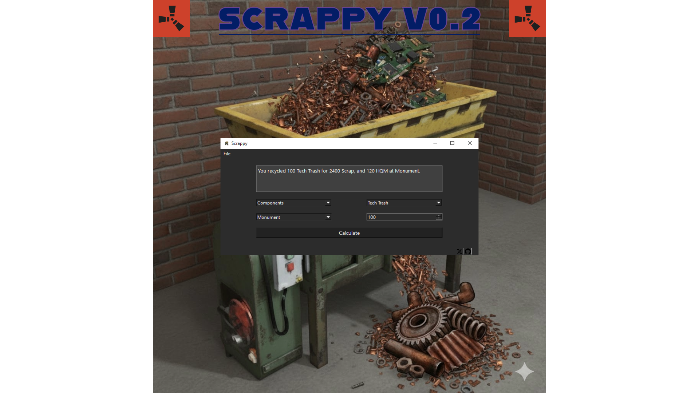

# Scrappy

Scrappy is a simple, yet handy, application for the game Rust and allows players to calculate how many resources various 
items will give from recycling at different locations on the map, such as Safe-Zones and Monuments, without the need to 
guess or keep notes written down.

# Overview

(https://www.youtube.com/watch?v=o-tSs5bSR3A)

Ever since the May 2025 update for Rust by FacePunch, the recyclers in game have been changed on how they work:

* Safe-Zones now only give 80% of the resources from every item.
* Monuments will now give 120% of the resources from every item.

This new update has made it less convenient to keep track of resource amounts, so this is how Scrappy works for you:

Instead of having to do math on paper, in your head, or even make guesses on what you'll get from recycling at different
locations, Scrappy automatically calculates the recycled item's resources by the appropriate number based on the location 
and item you select, giving you an edge when it comes to grinding and gathering resources.

**Not Affiliated with FacePunch or Anyone Else**

**It is open-source to ensure transparency with end-users.**

# Gallery

## Roadmap Ideas

1. Create and handle more items and resources in the JSON file.
2. Clean up and create a more clean, scalable UI.
3. Implement social media and other links inside the app.

## Download

[Download Scrappy](https://github.com/TheGameBoi/Scrappy/releases)

## **Copyright Information**

If I have used any data, images, or text inside my application that is copyrighted, please submit an issue to me and I will
ensure I remove any content per request by its rightful owner.
